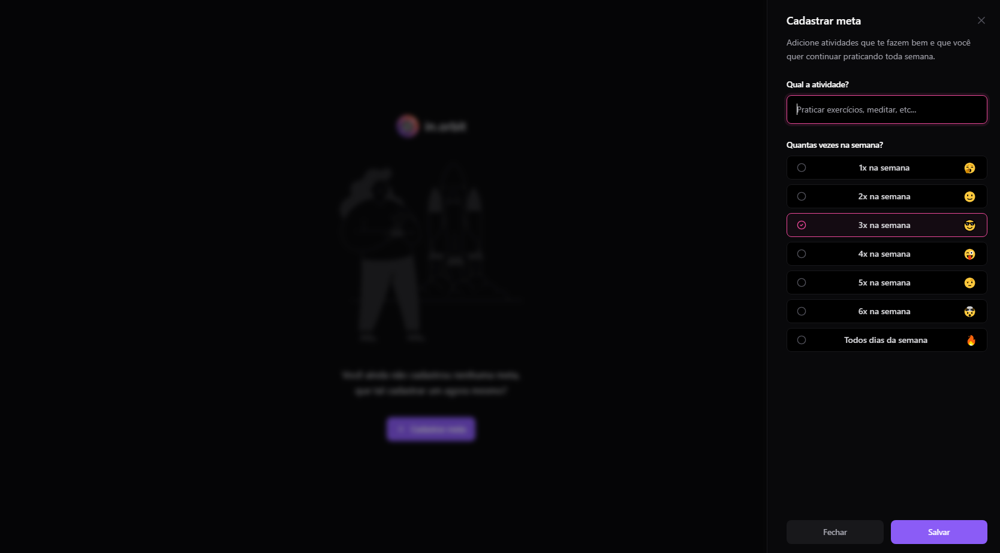
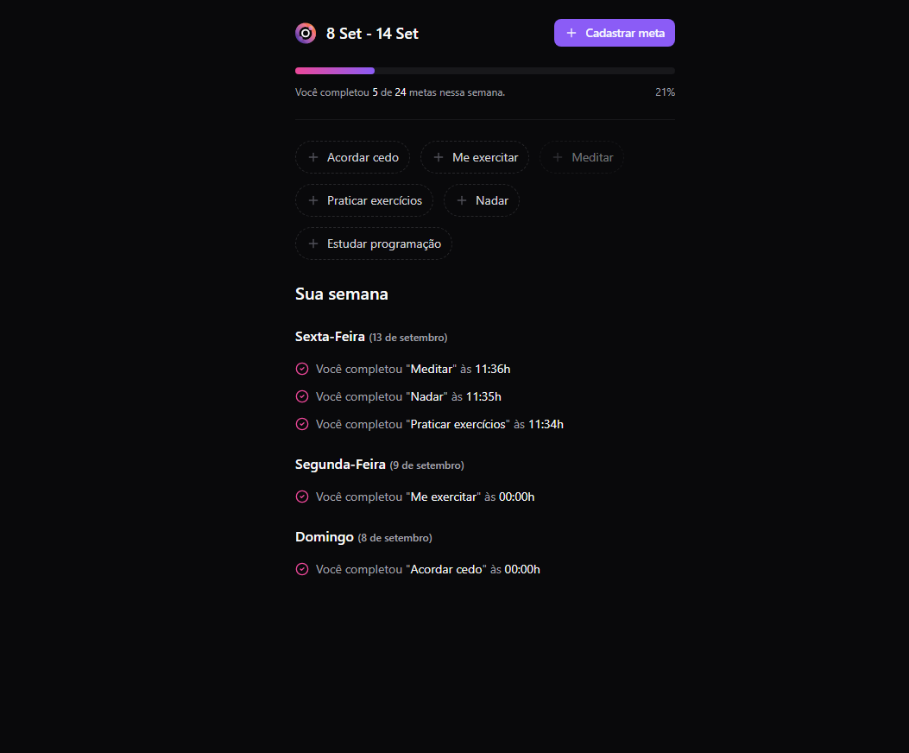
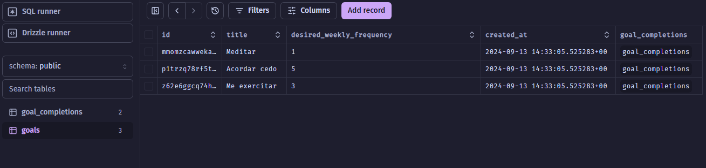

# InOrbit - Sistema de Gerenciamento de Metas

Este projeto foi feito na NLW Pocket e consiste em uma aplicação full-stack que permite o gerenciamento de metas pessoais semanais. O objetivo é criar, acompanhar e concluir atividades semanais, oferecendo uma interface amigável e moderna para os usuários.

## Tecnologias Utilizadas

### Back-end

- **Node.js**: Plataforma de desenvolvimento para o back-end.
- **Fastify**: Framework utilizado para construir a API REST de forma eficiente e rápida.
- **TypeScript**: Tipagem estática para um código mais seguro e previsível.
- **DrizzleORM**: ORM (Object-Relational Mapping) utilizado para gerenciar o banco de dados PostgreSQL.
- **PostgreSQL**: Banco de dados relacional para armazenamento de metas e atividades.
- **Docker**: Utilizado para containerização da aplicação, garantindo ambientes consistentes.
- **Zod**: Biblioteca para validação de dados de forma eficiente e segura.

### Front-end

- **ReactJS**: Biblioteca para construção da interface de usuário.
- **TypeScript**: Utilizado também no front-end para garantir tipagem estática e segurança.
- **Vite**: Ferramenta de build rápida e moderna para desenvolvimento com React e TypeScript.
- **TailwindCSS**: Framework CSS utilizado para a criação de uma interface responsiva e estilosa.
- **TanStack Query**: Utilizado para gerenciamento de dados assíncronos, facilitando o consumo de dados da API.

## Funcionalidades

### Back-end

- **API REST**: Implementação de rotas para gerenciar as metas, incluindo criação, consulta e conclusão de metas.
- **Integração com PostgreSQL**: O back-end realiza operações de leitura e escrita diretamente no banco de dados.
- **Validação de Dados**: Com a ajuda do Zod, os dados recebidos pela API são validados antes de serem inseridos no banco de dados.

### Front-end

- **Interface Responsiva**: Construída com TailwindCSS, se adapta a diferentes dispositivos (desktop e mobile).
- **Cadastro de Metas**: O usuário pode cadastrar metas, como "meditar" ou "se exercitar", escolhendo a frequência semanal desejada.
- **Acompanhamento de Metas**: O usuário pode ver as metas criadas e quais já foram concluídas durante a semana.
- **Interface Moderna**: A interface foi desenhada para ser intuitiva, minimalista e eficiente, facilitando a interação do usuário.

## Como Rodar o Projeto

### Pré-requisitos

- [Node.js](https://nodejs.org/)
- [Docker](https://www.docker.com/)
- [PostgreSQL](https://www.postgresql.org/)

### Passos para rodar o Back-end

1. Clone este repositório:

   ```bash
   git clone https://github.com/RodGondin/In.orbit.git
   cd in.orbit/server
   ```

2. Suba o ambiente utilizando Docker:

   ```bash
   docker-compose up -d
   ```

3. Rode as migrações para criar as tabelas no banco de dados:

   ```bash
   npx drizzle-kit generate
   npx drizzle-kit migrate
   ```

4. Execute o servidor:
   ```bash
   npm run dev
   ```

### Passos para rodar o Front-end

1. Entre na pasta do front-end:

   ```bash
   cd in.orbit/web
   ```

2. Instale as dependências:

   ```bash
   npm install
   ```

3. Rode o servidor de desenvolvimento:

   ```bash
   npm run dev
   ```

4. Acesse o front-end no navegador:
   ```
   http://localhost:3333
   ```

## Estrutura de Diretórios

### Back-end (`server`)

```
📦server
 ┣ 📂src
 ┃ ┣ 📂db
 ┃ ┃ ┣ 📜schema.ts
 ┃ ┃ ┣ 📜seed.ts
 ┃ ┣ 📂functions
 ┃ ┃ ┣ 📜create-goal.ts
 ┃ ┃ ┣ 📜get-week-summary.ts
 ┃ ┃ ┣ 📜get-week-pending-goals.ts
 ┃ ┣ 📂http
 ┃ ┃ ┣ 📂routes
 ┃ ┃ ┃ ┗ 📜server.ts
 ┣ 📜docker-compose.yml
 ┣ 📜drizzle.config.ts
 ┣ 📜package.json
 ┣ 📜tsconfig.json
```

### Front-end (`web`)

```
📦web
 ┣ 📂src
 ┃ ┣ 📂components
 ┃ ┃ ┣ 📜summary.tsx
 ┃ ┃ ┣ 📜pending-goals.tsx
 ┃ ┃ ┣ 📜create-goal.tsx
 ┃ ┣ 📂http
 ┃ ┃ ┣ 📜get-pending-goals.ts
 ┃ ┃ ┣ 📜get-summary.ts
 ┃ ┣ 📜app.tsx
 ┣ 📜index.html
 ┣ 📜package.json
 ┣ 📜tailwind.config.js
```

## Imagens de Demonstração





---
